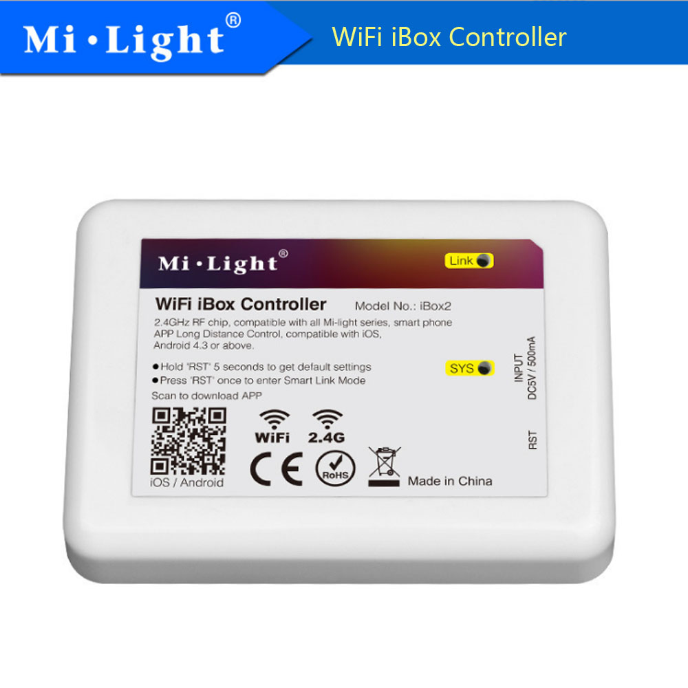
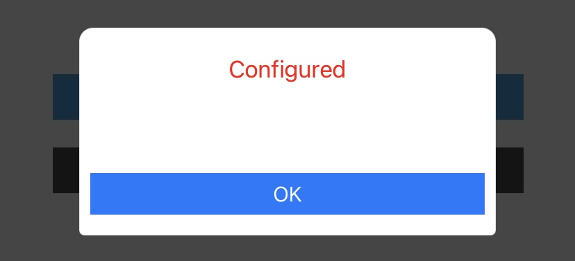
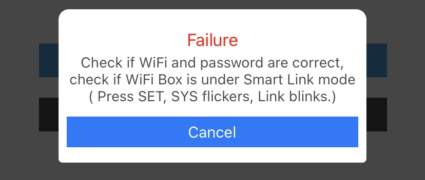

# MiLight WiFi Lights

Further reading: https://github.com/Erriez/milight_ibox2_control_python

## iBox1 Controller

Perform Factory Reset

- Power the controller
- Press and hold the small RTS button until both SYS and LINK LEDs flash and go out
- The device is back to its default settings and ready for SmartLink

## iBox2 Controller

Perform Factory Reset

- Power the controller
- Press and hold (using e.g. a paperclip) the RST button for 5 seconds
- Press the RST button one more time
- The device is back to its default settings and ready for SmartLink

## SmartLink the controller

Connect to the same wireless network as you want the controller to be on. Remember they only work on the 2.4 GHz WLAN frequency (802.11b/g/n/ax) and support the WPA2/PSK encryption.

- Open the [MiLight 3.0 app](https://apps.apple.com/nl/app/mi-light-3-0/id1156007632)
- Set the iBox in Link mode
  
- Choose SmarttLink (default)
- Fill in the WiFi password (SSID should already show)
- Start Configuration
  
- 
- In case of success:
  
- In case of failure (reset and try again):
  
