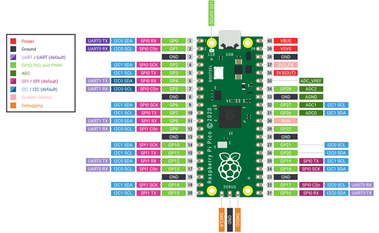

# Raspberry Pi Pico

https://pico.pinout.xyz

The Raspberry Pi Pico is based on the RP2040 microcontroller. The main differences between this board and it's W-less counterpart are of course the large silver WLAN chip, the location of the debug connector and the pin assignment for the builtin LED (WL_GPIO0 vs GPIO25)

## Getting started

https://projects.raspberrypi.org/en/projects/getting-started-with-the-pico
https://www.raspberrypi.com/documentation/microcontrollers/raspberry-pi-pico.html
https://datasheets.raspberrypi.com/pico/getting-started-with-pico.pdf
https://tutoduino.fr/en/pico-platformio/
https://www.schaerens.ch/pico-developing-for-raspberry-pi-pico-w-with-platformio-and-c-c/
https://github.com/earlephilhower/arduino-pico
https://thonny.org
https://github.com/raspberrypi/picotool
