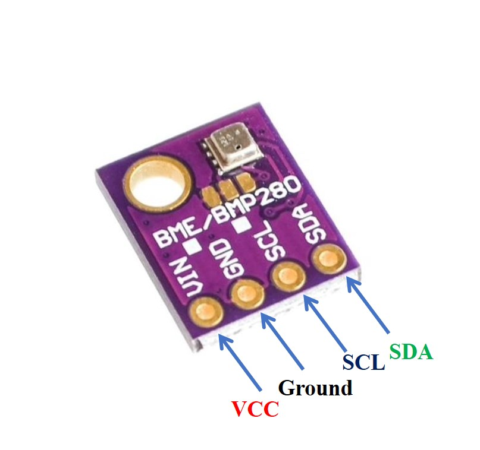

# BME280 Temperature, Humidity and Barometric Pressure Sensor



Next to the BME280 there's also a BMP280. The main difference is that the latter doesn't read the humidity. Here's a writeup for the BMP280 on which this documentation is based:
https://github.com/codehub-rony/raspberrypi_bmp280

In order to read values from the sensor connect it to a microcontroller through either the I2C or the SPI interface.

The following example is using I2C on a Raspberry Pi.

## Wiring

## I2C

Enable the interface:

```shell
sudo raspi-config nonint do_i2c 0
```

or follow the menu's using the `raspi-config` UI.

For I2C the address of the sensor can be found using the `i2c-tools` with the following command:

```shell
sudo i2cdetect -y 1
```

## Libraries

### Python

https://docs.circuitpython.org/projects/bme280/en/latest/api.html

Be sure to use Python 3 in order to install this Adafruit library.

```shell
 pip3 install adafruit-circuitpython-bme280
```

### C++

```python
import board
from adafruit_bme280 import basic as adafruit_bme280
i2c = board.I2C()  # uses board.SCL and board.SDA
bme280 = adafruit_bme280.Adafruit_BME280_I2C(i2c)
```
