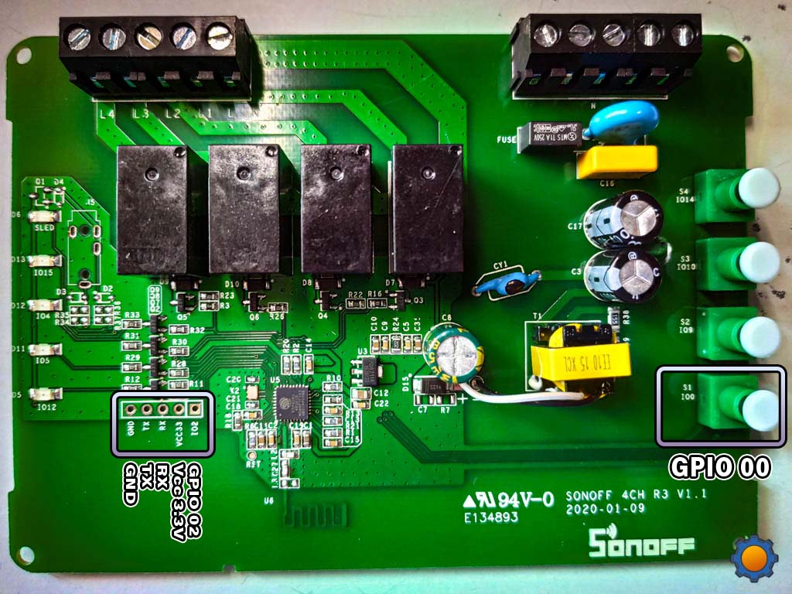

# Sonoff 4CH R3



This device is basically a Sonoff Basic, but with four relais instead of one.

The same procedure applies: [Sonoff Basic R2](../Sonoff%20Basic%20R2). Press and hold button 1 to initiate flash mode.

Of course now there are four switches to choose from, so the MQTT topics are slightly different:

```
cmds/tasmota4ch/POWER1
cmds/tasmota4ch/POWER2
cmds/tasmota4ch/POWER3
cmds/tasmota4ch/POWER4
```

The payloads on, off and toggle are the same.

https://tasmota.github.io/docs/MQTT/
